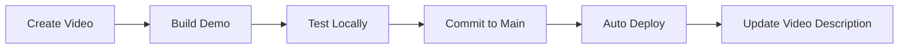

# 🎯 Project Gameplan Guidelines

This document outlines the strategic vision, development roadmap, and organizational principles for the Ominous Industries repository. It serves as a guide for project direction and prioritization.

---

## Vision

Ominous Industries aims to be a well-organized, accessible repository of interactive demos and supplementary content for Bijan Bowen's YouTube channel, focusing on AI model comparisons and technology reviews.

---

## Project Goals

### Primary Objectives

| Goal | Priority | Status |
|------|----------|--------|
| Host demo files for YouTube videos | High | ✅ Active |
| Auto-generate navigable file index | High | ✅ Implemented |
| Maintain consistent warm, orangey styling | High | ✅ Defined |
| Ensure accessible, mobile-friendly content | Medium | 🔄 Ongoing |
| Document contribution guidelines | Medium | ✅ Complete |

### Secondary Objectives

| Goal | Priority | Status |
|------|----------|--------|
| Add search functionality to index | Low | ✅ Implemented |
| Support multiple video categories | Low | 📋 Planned |
| Add RSS feed for updates | Low | 📋 Planned |
| Integrate analytics (privacy-respecting) | Low | 📋 Planned |

---

## Content Strategy

### Video Content Categories

Organize content by video type:

```
static/
├── AI Comparisons/          # Head-to-head tests
│   └── GPT-5.1 Pro vs.../
├── Full Reviews/            # Complete model reviews
│   └── Gemini 3 Pro.../
├── Tutorials/               # How-to content
├── Tools/                   # Utility demos
└── Experiments/             # Experimental content
```

### Naming Convention

Match folder names to YouTube video titles for easy identification:

```
✅ "GPT-5.1 Pro vs Gemini 3 Deep Think – Head-to-Head Testing!"
✅ "Gemini 3 Pro Deep Think FULL Test – Hands-On With Google's BEST Model!"
```

---

## Design Principles

### Visual Identity

The Ominous Industries brand uses:

1. **Warm, Orangey Tones** - Primary: `#E07B39`
2. **Light Backgrounds** - Cream: `#FDF8F3`
3. **Readable Typography** - System fonts
4. **Clean Layouts** - Generous whitespace
5. **Subtle Animations** - Purposeful, not distracting

### What We Avoid

❌ Purple, violet, or indigo colors
❌ Dark/navy backgrounds
❌ Aggressive animations
❌ Cluttered interfaces

---

## Development Workflow

### Standard Process



**Text representation** (if diagram doesn't render):
`Create Video → Build Demo → Test Locally → Commit to Main → Auto Deploy → Update Video Description`

### Steps in Detail

1. **Create Video** - Record and edit YouTube content
2. **Build Demo** - Create supporting HTML/CSS/JS files
3. **Test Locally** - Verify functionality in browsers
4. **Commit to Main** - Push changes to trigger deployment
5. **Auto Deploy** - GitHub Actions deploys to Pages
6. **Update Video** - Add GitHub Pages link to description

---

## Quality Standards

### Before Publishing Content

| Check | Required |
|-------|----------|
| HTML validates | ✅ Yes |
| No JS console errors | ✅ Yes |
| Mobile responsive | ✅ Yes |
| Uses correct color palette | ✅ Yes |
| Links work | ✅ Yes |
| Images have alt text | ⚠️ Recommended |
| Accessible navigation | ⚠️ Recommended |

### Performance Targets

| Metric | Target |
|--------|--------|
| Time to First Paint | < 1.5s |
| Time to Interactive | < 3s |
| Largest Contentful Paint | < 2.5s |
| Total Page Size | < 500KB |

---

## Security Priorities

### Always

1. ✅ Escape user inputs
2. ✅ Use textContent over innerHTML
3. ✅ Encode URLs properly
4. ✅ Pin action versions
5. ✅ No secrets in code

### Regular Review

- Monthly dependency checks
- Quarterly security audits
- Annual workflow review

---

## Content Roadmap

### Current State

```
Repository
├── Static demos for AI comparison videos
├── Auto-generated file index
├── GitHub Pages deployment
└── Comprehensive documentation
```

### Near-term Improvements (Next 3 months)

- [ ] Update index styling to orangey theme
- [ ] Add breadcrumb navigation
- [ ] Improve mobile experience
- [ ] Add loading states

### Long-term Vision (6-12 months)

- [ ] Category-based organization
- [ ] Search across all content
- [ ] Preview thumbnails
- [ ] Related content suggestions

---

## Contribution Priorities

### High Value Contributions

1. **Style Updates** - Align existing content with orangey theme
2. **Bug Fixes** - Fix broken links or display issues
3. **New Demos** - Content for new videos
4. **Documentation** - Improve clarity and completeness

### Lower Priority

1. New features not in roadmap
2. Major architectural changes
3. Third-party integrations

---

## Decision Framework

### When Adding Features

Ask these questions:

1. **Does it serve our users?** - YouTube viewers seeking demos
2. **Is it maintainable?** - Can we support it long-term?
3. **Does it match our aesthetic?** - Warm, orangey, welcoming
4. **Is it secure?** - No new vulnerabilities
5. **Is it accessible?** - Works for everyone

### When Changing Styles

Reference hierarchy:

1. `style.instructions.md` - Ultimate authority
2. Existing implementations - For consistency
3. Contributor suggestions - Considered input

---

## Maintenance Schedule

### Weekly

- Review and merge contributions
- Check deployment status
- Respond to issues

### Monthly

- Review analytics (if implemented)
- Check for broken links
- Update dependencies

### Quarterly

- Review documentation accuracy
- Assess roadmap progress
- Plan next quarter

### Annually

- Major version review
- Security audit
- Style guide review

---

## Success Metrics

### Repository Health

| Metric | Target |
|--------|--------|
| Deployment success rate | > 99% |
| Open issues | < 10 |
| PR response time | < 48 hours |

### Content Health

| Metric | Target |
|--------|--------|
| Working links | 100% |
| Mobile-friendly pages | 100% |
| Style compliance | 100% |

---

## Team Responsibilities

### Repository Owner

- Set strategic direction
- Approve major changes
- Maintain infrastructure
- Create video content

### Contributors

- Follow guidelines
- Submit quality PRs
- Report issues
- Suggest improvements

---

## Communication Channels

### For Contributors

- **GitHub Issues** - Bug reports, feature requests
- **Pull Requests** - Code contributions
- **Discussions** - General questions (if enabled)

### For Users

- **YouTube Comments** - Video feedback
- **Website Contact** - bijanbowen.com
- **GitHub Issues** - Demo problems

---

## Reference Documents

| Document | Purpose |
|----------|---------|
| `style.instructions.md` | Visual design standards |
| `license.instructions.md` | Licensing guidance |
| `repository.instructions.md` | Structure and organization |
| `workflow.instructions.md` | CI/CD and automation |
| `security.instructions.md` | Security best practices |
| `contributing.instructions.md` | How to contribute |
| `coding-standards.instructions.md` | Code quality standards |

---

## Quick Decision Tree

```
Should I make this change?
│
├── Is it a bug fix?
│   └── Yes → Submit PR
│
├── Is it a style update matching guidelines?
│   └── Yes → Submit PR
│
├── Is it new content for a video?
│   └── Yes → Submit PR
│
├── Is it a new feature?
│   └── Create issue first, discuss
│
└── Unsure?
    └── Create issue and ask
```

---

## Closing Notes

The Ominous Industries repository is a living project that evolves with each new video. The goal is to maintain a clean, organized, and welcoming space for viewers to explore demos and supplementary content.

Every contribution should make the repository:
- **More organized** - Not more cluttered
- **More accessible** - Not more complex
- **More beautiful** - In our warm, orangey way
- **More secure** - Never less safe

---

*Together, we build something ominously great! 🧡*

*Last updated: December 2024*